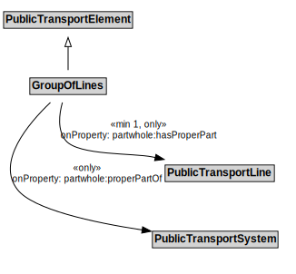

# GroupOfLines

## Restrictions

| Property | Restriction Type |
|----------|------------------|
| partwhole:hasProperPart | All values from PublicTransportLine |
| partwhole:properPartOf | All values from PublicTransportSystem |

## Other Annotations

- **terms:description**: A GroupOfLines is a logical grouping of PublicTransportLines for any useful purpose.
- **xsd:pattern**: PublicTransportSystemPattern

