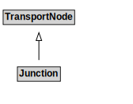

# Junction

## Other Annotations

- **terms:description**: A Junction is a TransportNode that allows a traveller to connect from one TravelledWayLink to another.
- **xsd:pattern**: TransportNetworkPattern

