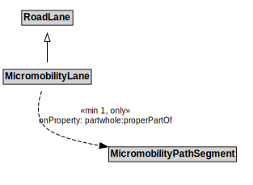

# MicromobilityLane

## Restrictions

| Property | Restriction Type |
|----------|------------------|
| partwhole:properPartOf | All values from MicromobilityPathSegment |

## Other Annotations

- **terms:description**: A MicromobilityLane is a type of RoadLane that forms part of a MicromobilityPathSegment.
- **xsd:pattern**: MicromobilityNetworkPattern

