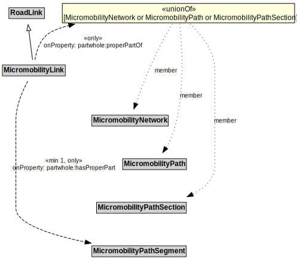

# MicromobilityLink

A MicromobilityLink is a type of RoadLink designed for micromobility vehicles.

## Formalization

| Property | Value Restriction |
|----------|-------------------|
| partwhole:hasProperPart | min 1 [MicromobilityPathSegment](MicromobilityPathSegment.md) |
| partwhole:hasProperPart | only [MicromobilityPathSegment](MicromobilityPathSegment.md) |
| partwhole:properPartOf | only ([MicromobilityNetwork](MicromobilityNetwork.md) or [MicromobilityPath](MicromobilityPath.md) or [MicromobilityPathSection](MicromobilityPathSection.md)) |
| rdfs:subClassOf | [RoadLink](RoadLink.md) |

## Other Annotations

- **xsd:pattern**: [MicromobilityNetworkPattern](MicromobilityNetworkPattern.md)

