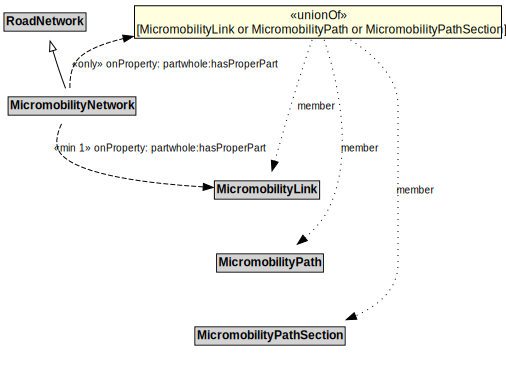

# MicromobilityNetwork

A MicromobilityNetwork is a type of RoadNetwork designed for the use of micromobility vehicles, which have more limited performance characteristics than motor vehicles.

## Formalization

| Property | Value Restriction |
|----------|-------------------|
| partwhole:hasProperPart | min 1 [MicromobilityLink](MicromobilityLink.md) |
| partwhole:hasProperPart | only ([MicromobilityLink](MicromobilityLink.md) or [MicromobilityPath](MicromobilityPath.md) or [MicromobilityPathSection](MicromobilityPathSection.md)) |
| rdfs:subClassOf | [RoadNetwork](RoadNetwork.md) |

## Other Annotations

- **xsd:pattern**: [MicromobilityNetworkPattern](MicromobilityNetworkPattern.md)

