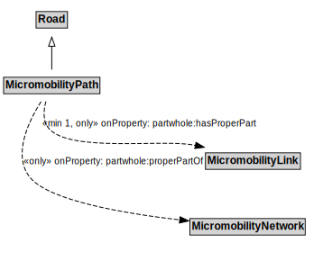

# MicromobilityPath

## Restrictions

| Property | Restriction Type |
|----------|------------------|
| partwhole:hasProperPart | All values from MicromobilityLink |
| partwhole:properPartOf | All values from MicromobilityNetwork |

## Other Annotations

- **terms:description**: A MicromobilityPath is a type of Road that is made up of MicromobilityPathLinks.
- **xsd:pattern**: MicromobilityNetworkPattern

