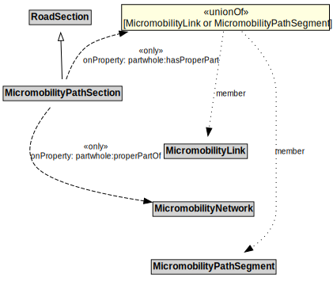

# MicromobilityPathSection

A MicromobilityPathSections is a type of RoadSection that groups MicromobilityLinks and MicromobilityPathSegments for a useful operational purpose (e.g., assigning a speed limit, designating areas of shared use).

## Formalization

| Property | Value Restriction |
|----------|-------------------|
| partwhole:hasProperPart | only ([MicromobilityLink](MicromobilityLink.md) or [MicromobilityPathSegment](MicromobilityPathSegment.md)) |
| partwhole:properPartOf | only [MicromobilityNetwork](MicromobilityNetwork.md) |
| rdfs:subClassOf | [RoadSection](RoadSection.md) |

## Other Annotations

- **xsd:pattern**: [MicromobilityNetworkPattern](MicromobilityNetworkPattern.md)

