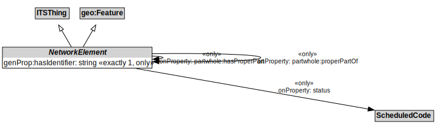

# NetworkElement

A NetworkElement represents any element of a transport network. It can be a part of another NetworkElement and can be decomposed into smaller NetworkElements.

## Formalization

| Property | Value Restriction |
|----------|-------------------|
| genProp:hasIdentifier | exactly 1 xsd:string |
| genProp:hasIdentifier | only xsd:string |
| partwhole:hasProperPart | only [NetworkElement](NetworkElement.md) |
| partwhole:properPartOf | only [NetworkElement](NetworkElement.md) |
| rdfs:subClassOf | [ITSThing](ITSThing.md) |
| rdfs:subClassOf | geo:Feature |
| status | only [ScheduledCode](ScheduledCode.md) |

## Other Annotations

- **protege:abstract**: true
- **xsd:pattern**: [TransportNetworkPattern](TransportNetworkPattern.md)

