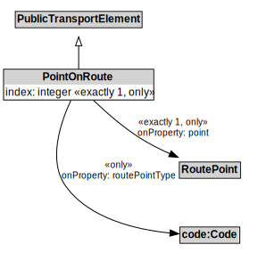

# PointOnRoute

## Restrictions

| Property | Restriction Type |
|----------|------------------|
| index | All values from xsd:integer |
| point | All values from RoutePoint |
| routePointType | All values from code:Code |

## Other Annotations

- **terms:description**: A PointOnRoute represents an ordered RoutePoint for a PublicTransportRoute.
- **xsd:pattern**: PublicTransportSystemPattern

