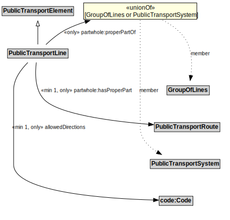

# PublicTransportLine

## Restrictions

| Property | Restriction Type |
|----------|------------------|
| allowedDirections | All values from code:Code |
| partwhole:hasProperPart | All values from PublicTransportRoute |

## Other Annotations

- **terms:description**: A PublicTransportLine is one or more routes used by public transport vehicles to transport passengers to and from designated locations.
- **xsd:pattern**: PublicTransportSystemPattern

