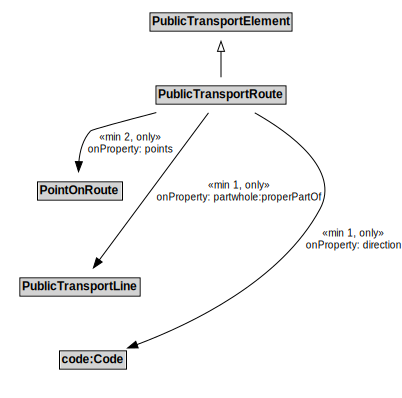

# PublicTransportRoute

A PublicTransportRoute represents one specific path used by a public transport vehicle to transport passengers to and from designated locations.

NOTE: For example, a PublicTransportLine might use an alternate PublicTransportRoute to reach its next stop during periods of congestion.

## Formalization

| Property | Value Restriction |
|----------|-------------------|
| direction | min 1 code:Code |
| direction | only code:Code |
| partwhole:properPartOf | min 1 [PublicTransportLine](PublicTransportLine.md) |
| partwhole:properPartOf | only [PublicTransportLine](PublicTransportLine.md) |
| points | min 2 [PointOnRoute](PointOnRoute.md) |
| points | only [PointOnRoute](PointOnRoute.md) |
| rdfs:subClassOf | [PublicTransportElement](PublicTransportElement.md) |

## Other Annotations

- **xsd:pattern**: [PublicTransportSystemPattern](PublicTransportSystemPattern.md)

