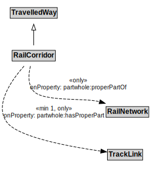

# RailCorridor

## Restrictions

| Property | Restriction Type |
|----------|------------------|
| partwhole:hasProperPart | All values from TrackLink |
| partwhole:properPartOf | All values from RailNetwork |

## Other Annotations

- **terms:description**: A RailCorridor is a type of TravelledWay that is made up of TrackLinks.
- **xsd:pattern**: RailNetworkPattern

