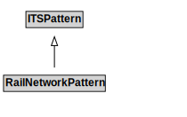

# RailNetworkPattern

## Other Annotations

- **terms:description**: The rail network pattern specializes the transport network pattern to address the needs for travel of rail vehicles (e.g., trains, subways, trams).

