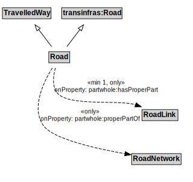

# Road

A Road is a type of TravelledWay and transinfras:Road that is made up of RoadLinks. Roads form a proper part of RoadNetworks.

## Formalization

| Property | Value Restriction |
|----------|-------------------|
| partwhole:hasProperPart | min 1 [RoadLink](RoadLink.md) |
| partwhole:hasProperPart | only [RoadLink](RoadLink.md) |
| partwhole:properPartOf | only [RoadNetwork](RoadNetwork.md) |
| rdfs:subClassOf | [TravelledWay](TravelledWay.md) |
| rdfs:subClassOf | transinfras:[Road](Road.md) |

## Other Annotations

- **xsd:pattern**: [RoadNetworkPattern](RoadNetworkPattern.md)

