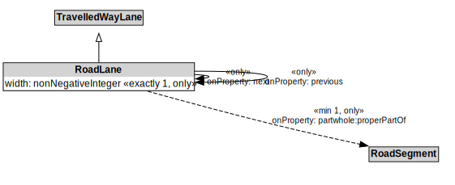

# RoadLane

## Restrictions

| Property | Restriction Type |
|----------|------------------|
| next | All values from RoadLane |
| partwhole:properPartOf | All values from RoadSegment |
| previous | All values from RoadLane |
| width | All values from xsd:nonNegativeInteger |

## Other Annotations

- **terms:description**: A RoadLane is a type of TravelledWayLane that forms part of a RoadSegment.
- **xsd:pattern**: RoadNetworkPattern

