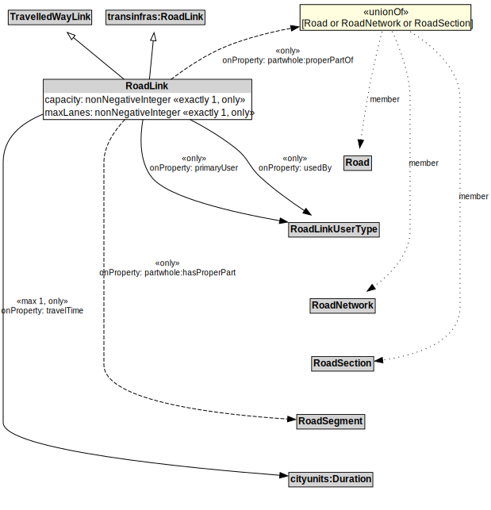

# RoadLink

## Restrictions

| Property | Restriction Type |
|----------|------------------|
| capacity | All values from xsd:nonNegativeInteger |
| maxLanes | All values from xsd:nonNegativeInteger |
| partwhole:hasProperPart | All values from RoadSegment |
| primaryUser | All values from RoadLinkUserType |
| travelTime | All values from cityunits:Duration |
| usedBy | All values from RoadLinkUserType |

## Other Annotations

- **terms:description**: A RoadLink is a type of TravelledWayLink and transinfras:RoadLink using a stabilized base designed for the movement of vehicles that conform to a specified set of requirements but may be used by others as well.
- **xsd:pattern**: RoadNetworkPattern

