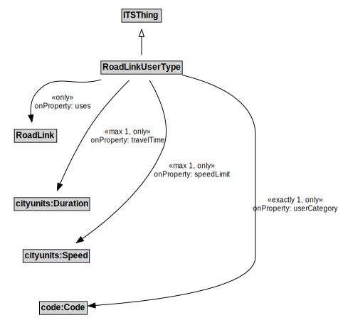

# RoadLinkUserType

A RoadLinkUserType represents the unique combination of a RoadLink and a UserType such that speed limits and other characteristics can be defined to apply to specific user types when operating along a particular road link.

## Formalization

| Property | Value Restriction |
|----------|-------------------|
| rdfs:subClassOf | [ITSThing](ITSThing.md) |
| speedLimit | max 1 cityunits:Speed |
| speedLimit | only cityunits:Speed |
| travelTime | max 1 cityunits:Duration |
| travelTime | only cityunits:Duration |
| userCategory | exactly 1 code:Code |
| userCategory | only code:Code |
| uses | only [RoadLink](RoadLink.md) |

## Other Annotations

- **xsd:pattern**: [RoadNetworkPattern](RoadNetworkPattern.md)

