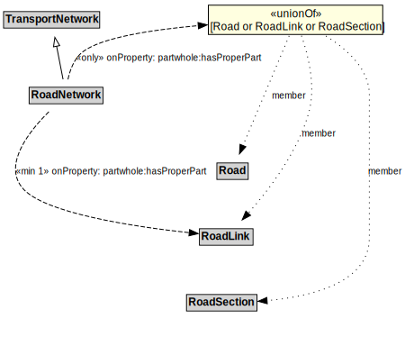

# RoadNetwork

Roads are most commonly associated with motor vehicles, but can be designed for other types of vehicles (e.g., micromobility vehicles).

## Other Annotations

- **terms:description**: A RoadNetwork is a type of TransportNetwork using a stabilized base designed for the movement of vehicles, other than rail or air vehicles, that conform to a specified set of requirements but may be used by others as well.
- **xsd:pattern**: RoadNetworkPattern

