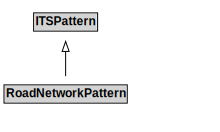

# RoadNetworkPattern

## Other Annotations

- **terms:description**: The road network pattern specializes the transport network pattern to address the needs for vehicular travel. Road networks that are primarily designed for the movement of micromobility vehicles should generally be defined using the micromobility network pattern, which is a specialization of this pattern.

