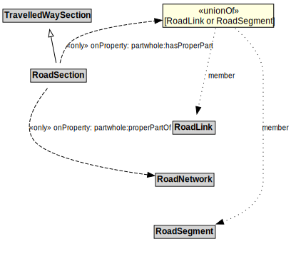

# RoadSection

## Restrictions

| Property | Restriction Type |
|----------|------------------|
| partwhole:properPartOf | All values from RoadNetwork |

## Other Annotations

- **terms:description**: A RoadSection is a type of TravelledWaySection that groups RoadLinks and RoadSegments for a useful operational purpose (e.g., assigning a speed limit, designating a traffic control scheme).
- **xsd:pattern**: RoadNetworkPattern

