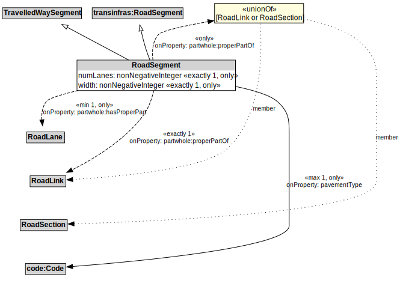

# RoadSegment

A RoadSegment can be defined to be a part of a RoadSection, for example, when the RoadSection does not span an entire RoadLink.

## Restrictions

| Property | Restriction Type |
|----------|------------------|
| numLanes | All values from xsd:nonNegativeInteger |
| partwhole:hasProperPart | All values from RoadLane |
| pavementType | All values from code:Code |
| width | All values from xsd:nonNegativeInteger |

## Other Annotations

- **terms:description**: A RoadSegment is a type of TravelledWaySegment and transinfas:RoadSegment that represents a portion of a RoadLink with common physical characteristics.
- **xsd:pattern**: RoadNetworkPattern

