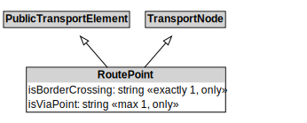

# RoutePoint

## Restrictions

| Property | Restriction Type |
|----------|------------------|
| isBorderCrossing | All values from xsd:boolean |
| isViaPoint | All values from xsd:boolean |

## Other Annotations

- **terms:description**: A RoutePoint represents a point of interest along a PublicTransportRoute.
- **xsd:pattern**: PublicTransportSystemPattern

