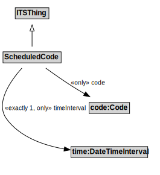

# ScheduledCode

The operational status of an entity, e.g., open or closed.

## Formalization

| Property | Value Restriction |
|----------|-------------------|
| code | only code:Code |
| rdfs:subClassOf | [ITSThing](ITSThing.md) |
| timeInterval | exactly 1 time:DateTimeInterval |
| timeInterval | only time:DateTimeInterval |

## Other Annotations

- **xsd:pattern**: [TransportNetworkPattern](TransportNetworkPattern.md)

