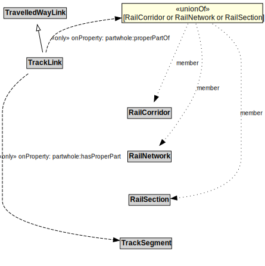

# TrackLink

Due to the nature of rail, each TrackLink consists of a single lane, but multiple TrackLinks can exist along the same RailCorridor.

## Restrictions

| Property | Restriction Type |
|----------|------------------|
| partwhole:hasProperPart | All values from TrackSegment |

## Other Annotations

- **terms:description**: A TrackLink is a type of TravelledWayLink that uses rails on a stabilized base.
- **xsd:pattern**: RailNetworkPattern

