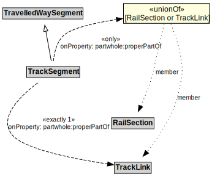

# TrackSegment

## Other Annotations

- **terms:description**: A TrackSegment is a type of TravelledWaySegment that represents a portion of a TrackLink with common physical characteristics.
- **xsd:pattern**: RailNetworkPattern

