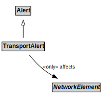

# TransportAlert

## Restrictions

| Property | Restriction Type |
|----------|------------------|
| affects | All values from NetworkElement |

## Other Annotations

- **terms:description**: A TransportAlert is a type of alert that can be used to notify people of important transport information.
- **xsd:pattern**: TransportAlertPattern

