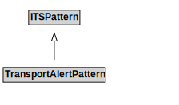

# TransportAlertPattern

## Other Annotations

- **skos:note**: It is expected that the definition of the generalized Alert will migrate to ISO/IEC 5087-1 or ISO/IEC 5087-2 at some point in the future.
- **terms:description**: The transport alert pattern addresses the need for public agencies to alert groups to unusual transport-related conditions. Most of the features of the transport alert pattern can also be used for other types of alerts (e.g., meteorological events) and as such, its design includes the definition of a generalized alert.

