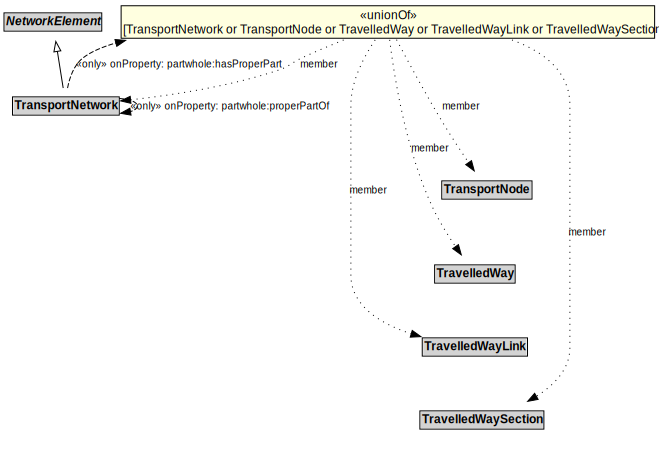

# TransportNetwork

A TransportNetwork is a NetworkElement that is a collection of other network elements that jointly represent a network of paths along which entities (e.g., vehicles, pedestrians) of a specified mode can operate.

## Formalization

| Property | Value Restriction |
|----------|-------------------|
| partwhole:hasProperPart | only ([TransportNetwork](TransportNetwork.md) or [TransportNode](TransportNode.md) or [TravelledWay](TravelledWay.md) or [TravelledWayLink](TravelledWayLink.md) or [TravelledWaySection](TravelledWaySection.md)) |
| partwhole:properPartOf | only [TransportNetwork](TransportNetwork.md) |
| rdfs:subClassOf | [NetworkElement](NetworkElement.md) |

## Other Annotations

- **xsd:pattern**: [TransportNetworkPattern](TransportNetworkPattern.md)

