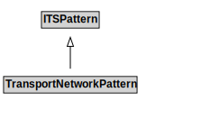

# TransportNetworkPattern

## Other Annotations

- **terms:description**: The Transport Network Pattern models the core concepts involved in describing a transport network. This includes an identification of both physical and administrative characteristics. The most general class is that of the NetworkElement, which can be further classified as one of several types of NetworkElements.

A key feature of this pattern is the formalization of the hasProperPart relationship from a NetworkElement to another NetworkElement. This allows for a representation of networks at multiple levels of detail. For example, at one level, a motorway interchange can be modelled as a single Node. But that node is a NetworkElement that can be defined to consist of an entire TransportNetwork that has a node for each junction within the interchange.

