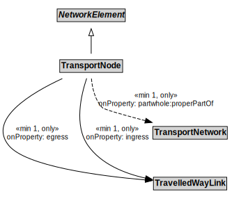

# TransportNode

## Restrictions

| Property | Restriction Type |
|----------|------------------|
| egress | All values from TravelledWayLink |
| ingress | All values from TravelledWayLink |
| partwhole:properPartOf | All values from TransportNetwork |

## Other Annotations

- **terms:description**: A TransportNode is a NetworkElement that represents a node on the transport network that can be used to designate an end to a link or to join links.
- **xsd:pattern**: TransportNetworkPattern

