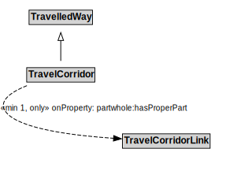

# TravelCorridor

## Restrictions

| Property | Restriction Type |
|----------|------------------|
| partwhole:hasProperPart | All values from TravelCorridorLink |

## Other Annotations

- **skos:note**: The extent of a TravelCorridor is defined by the extent of the path that shares the designator assigned to the TravelCorridor.
- **terms:description**: A TravelCorridor is a type of TravelledWay that is made up of TravelCorridorLinks.
- **xsd:pattern**: TravelCorridorPattern

