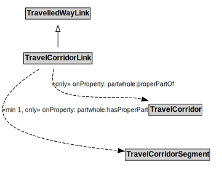

# TravelCorridorLink

A TravelCorridorLink is a type of TravelledWayLink that is made up of TravelCorridorSegments.

## Formalization

| Property | Value Restriction |
|----------|-------------------|
| partwhole:hasProperPart | min 1 [TravelCorridorSegment](TravelCorridorSegment.md) |
| partwhole:hasProperPart | only [TravelCorridorSegment](TravelCorridorSegment.md) |
| partwhole:properPartOf | only [TravelCorridor](TravelCorridor.md) |
| rdfs:subClassOf | [TravelledWayLink](TravelledWayLink.md) |

## Other Annotations

- **xsd:pattern**: [TravelCorridorPattern](TravelCorridorPattern.md)

