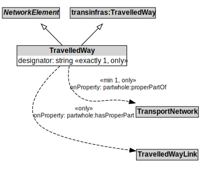

# TravelledWay

A TravelledWay is a type of NetworkElement and transinfras:TravelledWay that represents the curvilinear length of a transport route that is identified by a specific designator.

## Formalization

| Property | Value Restriction |
|----------|-------------------|
| designator | exactly 1 xsd:string |
| designator | only xsd:string |
| partwhole:hasProperPart | only [TravelledWayLink](TravelledWayLink.md) |
| partwhole:properPartOf | min 1 [TransportNetwork](TransportNetwork.md) |
| partwhole:properPartOf | only [TransportNetwork](TransportNetwork.md) |
| rdfs:subClassOf | [NetworkElement](NetworkElement.md) |
| rdfs:subClassOf | transinfras:[TravelledWay](TravelledWay.md) |

## Other Annotations

- **xsd:pattern**: [TransportNetworkPattern](TransportNetworkPattern.md)

