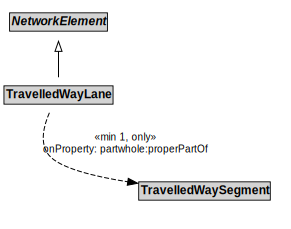

# TravelledWayLane

## Restrictions

| Property | Restriction Type |
|----------|------------------|
| partwhole:properPartOf | All values from TravelledWaySegment |

## Other Annotations

- **terms:description**: A TravelledWayLane is a NetworkElement that is a portion of TravelledWaySegment intended to accommodate a single line of moving material entities (e.g., vehicles) along its length.
- **xsd:pattern**: TransportNetworkPattern

