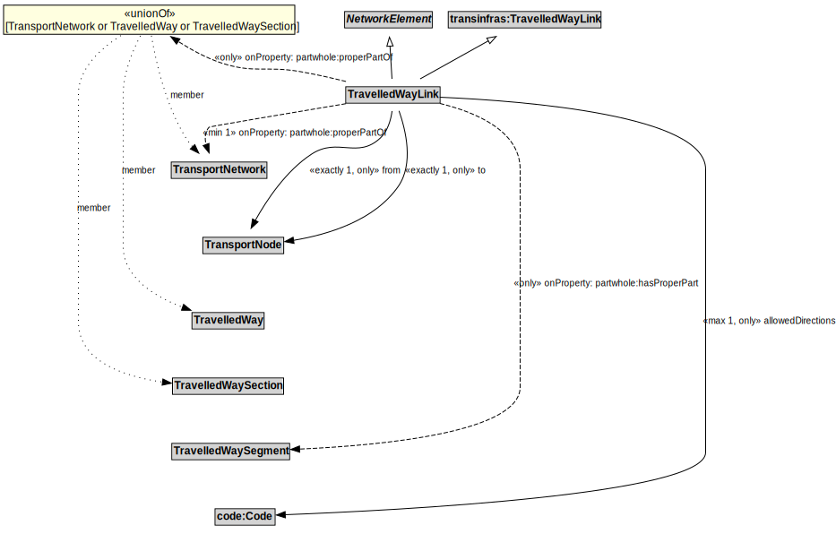

# TravelledWayLink

## Restrictions

| Property | Restriction Type |
|----------|------------------|
| allowedDirections | All values from code:Code |
| from | All values from TransportNode |
| partwhole:hasProperPart | All values from TravelledWaySegment |
| to | All values from TransportNode |

## Other Annotations

- **terms:description**: A TravelledWayLink is a type of NetworkElement and transinfras:TravelledWayLink. It represents a contiguous length of a TravelledWay between two TransportNodes of operational or managerial significance.
- **xsd:pattern**: TransportNetworkPattern

