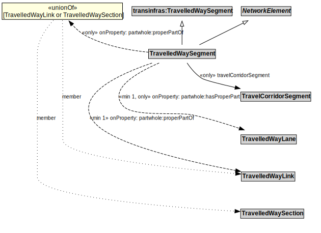

# TravelledWaySegment

A TravelledWaySegment is a type of a transinfras:TravelledWaySegment and NetworkElement that represents a contiguous length of a TravelledWayLink characterized by the same physical characteristics.

## Formalization

| Property | Value Restriction |
|----------|-------------------|
| partwhole:hasProperPart | min 1 [TravelledWayLane](TravelledWayLane.md) |
| partwhole:hasProperPart | only [TravelledWayLane](TravelledWayLane.md) |
| partwhole:properPartOf | min 1 [TravelledWayLink](TravelledWayLink.md) |
| partwhole:properPartOf | only ([TravelledWayLink](TravelledWayLink.md) or [TravelledWaySection](TravelledWaySection.md)) |
| rdfs:subClassOf | [NetworkElement](NetworkElement.md) |
| rdfs:subClassOf | transinfras:[TravelledWaySegment](TravelledWaySegment.md) |
| travelCorridorSegment | only [TravelCorridorSegment](TravelCorridorSegment.md) |

## Other Annotations

- **xsd:pattern**: [TransportNetworkPattern](TransportNetworkPattern.md)

